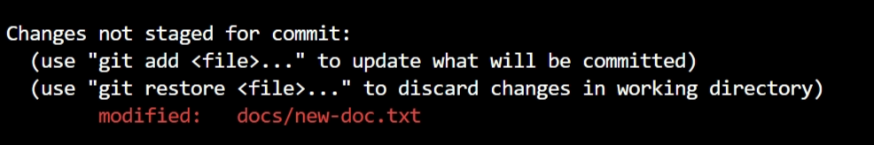
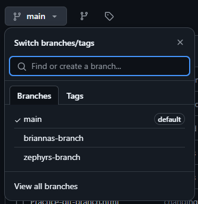

# Instructions to set up Git

### 1. Create a place to put your `cloned repository files`
**Common commands: (PC Users) **
- `mkdir your-directory-name` makes a directory 
- `cd name-of-directory` enters your directory 
- `dir` shows contents of a directory
- `cls` clears your terminal 

### 2. Cloning the Repo
1. In your Github repo - click on the `<> Code` dropdown button & copy the repo url
 or just use ``` https://github.com/chingu-voyages/v52-tier1-team-03.git ```


2. In your VS code terminal type 
``` git clone https://github.com/chingu-voyages/v52-tier1-team-03.git ``` 
This should clone the repo and it should appear in your designated folder if your /path is correct. 

### Setting Up Your Branch
1. To create a branch ``` git branch your-name ``` 
2. To enterselect your branch ``` git checkout your-branch-name ```
3. To check `which branch` you are currently in
 ```git branch ``` an asterix (*) will appear next to your current branch 
4. Make sure you are committing to the latest  `main branch`  updates by running
``` git pull ```.

### How To Make Your Branch Appears on Github
1. Create a test document - it could be something as simple as `practice-git.txt` with some basic content like `hello, it’s me!`.
2. Go back to your terminal and type in 
``` git status ``` and you should see the newest changes show up in `red`.



3. Then type in ``` git add .``` to add `newest` changes
4. If you type in `git status` again you’ll notice all the changes stated were once `red` are now `green`.


5. Now type ``` git commit -m "your message describing your latest change" ```
6. (optional and good practice) Double check and make sure everything is running smoothly by running `git status` again 
7. Run ``` git push ``` to push your newest changes up to your github branch.
You’ll see some code pop up, and again (completely optional) but I usually run `git status` one last time - just to make sure everything has been run smoothly - before running `cls` to clear the terminal.

### Locate Your Branch on Github
In order to see your branch appear on your Github repo
1. Click on the `Main`  button to open the dropdown and then select `View All Branches`
2. You probably *won’t see it* listed on there right away so hit `refresh` and it should pop up under `"your-name branch"`.

Great job!You’ve successfully created an independent branch on your Github repo to commit your work.
~ Happy coding!
